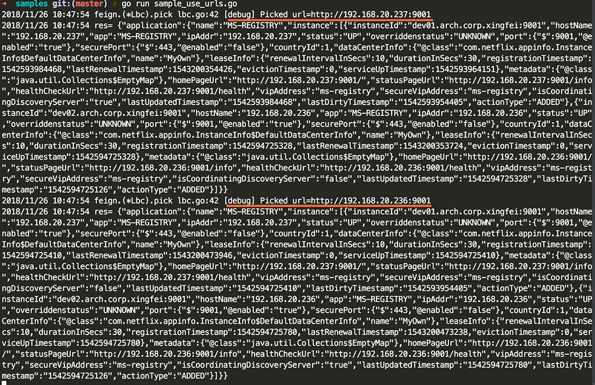

### Go-feign

Non-offical implementation of Spring Cloud feign. Tips: Non-full-features, only some basic and useful features implemented.

Use [go-eureka-client](https://github.com/HikoQiu/go-eureka-client) together, cos go-feign uses go-eureka-client to discover registry apps and gets all apps' instances.


Supported features.

#### Sample 1

Request urls from configuration.

````
    // 1.1 configure maps, app => app's urls
    feign.DefaultFeign.UseUrls(map[string][]string{
        "MS-REGISTRY-URLS": {"http://192.168.20.236:9001", "http://192.168.20.237:9001"},
    })

    // 2.1 Use app name to balancely request all instances
    res, err := feign.DefaultFeign.App("MS-REGISTRY-URLS").R().SetHeaders(map[string]string{
        "Content-Type": "application/json",
    }).Get("/eureka/apps/MS-REGISTRY")
    if err != nil {
        log.Println("err: ", err.Error())
        return
    }
    log.Println("res=", string(res.Body()))
````

Full sample code, refer to: [samples/sample_use_urls.go](./samples/sample_use_urls.go)

#### Sample 2

Use discovery client to get all registry apps, and then request app's urls from registry balancely.

````
    // use go-eureka-client to communicate with registry
    runEurekaClient()

    // feign.DefaultFeign use eureka.DefaultClient to get registry apps
    res, err := feign.DefaultFeign.App("MS-REGISTRY").R().
        SetHeaders(map[string]string{
        "Content-Type": "application/json",
    }).Get("/eureka/apps/WM")
    if err != nil {
        log.Println("err=", err.Error())
        return
    }

    log.Println("res=", string(res.Body()))

````

Full sample code, refer to: [samples/sample_use_discover_client.go](./samples/sample_use_discover_client.go)

#### Sample 3

Mixed use of UseUrls() and UseDiscoveryClient().

````
    // 1.1 configure maps, app => app's urls
    feign.DefaultFeign.UseUrls(map[string][]string{
        "MS-REGISTRY-URLS": {"http://192.168.20.236:9001", "http://192.168.20.237:9001"},
    })

    // 1.2 use discovery client
    config := eureka.GetDefaultEurekaClientConfig()
    config.UseDnsForFetchingServiceUrls = true
    config.Region = "region-cn-hd-1"
    config.AvailabilityZones = map[string]string{
        "region-cn-hd-1": "zone-cn-hz-1",
    }
    config.EurekaServerDNSName = "dev.ms-registry.xf.io"
    config.EurekaServerUrlContext = "eureka"
    config.EurekaServerPort = "9001"
    eureka.DefaultClient.Config(config).
        Register("APP_ID_CLIENT_FROM_DNS", 9000).
        Run()

    // 2.1 request by registry apps
    log.Println("----> request by registy apps")
    // assign a eureka client explicitly, or use the eureka.DefaultClient by default.
    //feign.DefaultFeign.UseDiscoveryClient(eureka.DefaultClient)
    res, err := feign.DefaultFeign.App("MS-REGISTRY").R().SetHeaders(map[string]string{
        "Content-Type": "application/json",
    }).Get("/eureka/apps/WM")
    if err != nil {
        log.Println("err=", err.Error())
        return
    }

    log.Println("res=", string(res.Body()))

    // 2.2 request by configuration apps
    log.Println("----> request by configuration apps")
    res, err = feign.DefaultFeign.App("MS-REGISTRY-URLS").R().SetHeaders(map[string]string{
        "Content-Type": "application/json",
    }).Get("/eureka/apps/WM")
    if err != nil {
        log.Println("err=", err.Error())
        return
    }

    log.Println("res=", string(res.Body()))
````

### Sample screenshots


